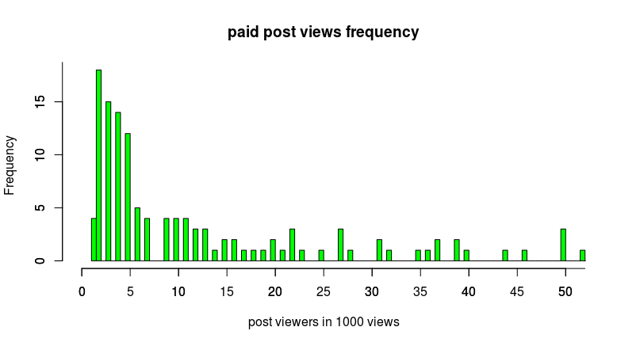
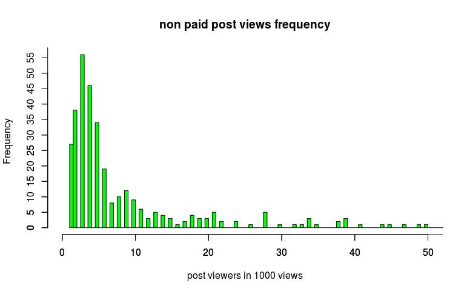
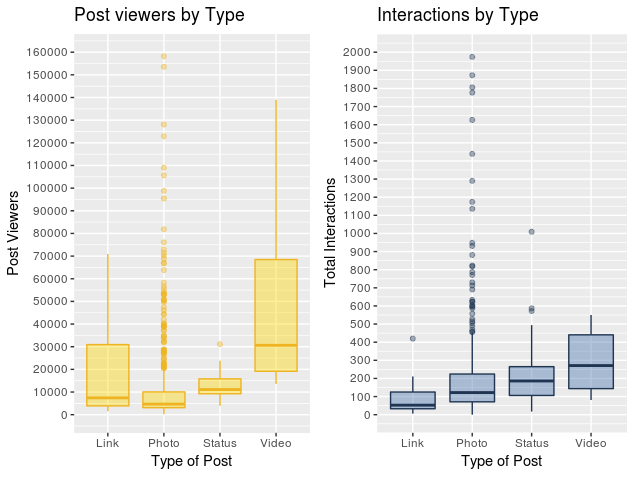
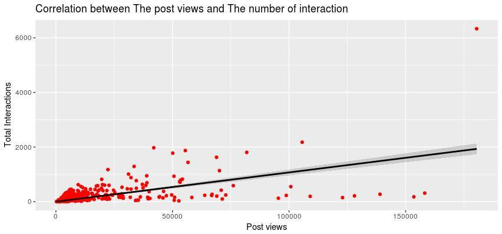
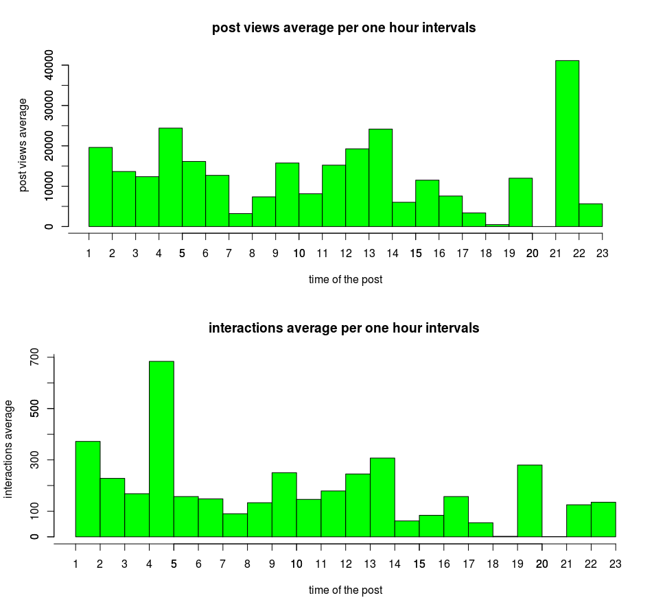

```{r setup, include=FALSE}
knitr::opts_chunk$set(echo=TRUE)
```

# Introduction
Since the creation of social networks such as Facebook and Twitter, the number of users has increased from 1 billion in 2013 to almost 2 billion today, predicting even a bigger increase in the next years. Considering this rapid development, social media may become the most important media channel for brands to reach their clients in the near future.

Realizing the potential of Internet-based social networks, companies use social networks  to leverage their businesses. Several studies have been conducted to predict the relation between the online publications on social networks and the impact of such publications measured by users' interactions. We made a similar study to understand the impact of advertisement on Facebook on the number of views and interactions to find out the benefits of putting advertisements of social networks.  

## DataSet
The data set studied in this paper is a representative data set of published posts on the Facebook's page of a renowned cosmetic brand between the 1st of January and the 31st of December in 2014. It was found on the UC Irvine Machine Learning Repository.
The data set comprises of the following attributes:
 
* Page Total Likes: The number of likes a page has on all its posts.

* Type: This is the type of the post i.e photo or link.

* Post Month: This is the month in which the post was published.

* Post Weekday: This is the day of the week on which the post was published.

* Post Hour: This is the hour of the day at which the post was published.

* Paid: This tells if the post is paid or non paid.

* Post Viewers: This is the number of users who viewed the post.

* Comment: Number of comments on the post.

* Like: Number of likes on the post.

* Share: Number of times a post was shared.

* Total Interaction: It gives the summation of the comment, like and share.

## Observations
Using the above data set we verified the following observations:

* Comaprison of Number of views to be expected in case of paid posts and unpaid posts. This observation helped us in finding out the effectiveness of advertising on Facebook.

* Relation between type of a post and number of views and interactions associated with it.

* Correlation between number of views on a post and number of interactions with the post.
  This shows that the number of views are directly related to number of interactions.

* Relation between time of the post and number of views on the post.

# Material and Methods

* Mean: It is the average and is computed as the sum of all the observed outcomes  from the sample divided by the total number of events. It is given as:

$$ \overline{x} = \frac{1}{n}  \sum_{i=1}^n   x   $$

* Variance: It is the expectation of the squared deviation of a random variable from its mean, and it informally measures how far a set of (random) numbers are spread out from their mean.

$$ S^{2} = \frac{1}{n-1}  \sum_{i=1}^n (x- \overline{x} )^2 $$

* Standard Deviation: It is a measure that is used to quantify the amount of variation or dispersion of a set of data values.

$$ S = \sqrt{ \frac{1}{n-1}  \sum_{i=1}^n (x- \overline{x} )^2} $$

* Confidence Interval: It a range of values so defined that there is a specified probability that the value of a parameter lies within it.

$$  \overline{x} \pm  t^{*}  \frac{s}{ \sqrt{n} } $$

* Covariance: It is a measure of the joint variability of two random variables.

$$  cov(X,Y)=E[(X- \mu x)(Y- \mu y)] $$


* Correlation: Correlation is a statistical measure that indicates the extent to which two or more variables fluctuate together. 

$$ \rho x,y = corr(X,Y) = \frac{cov(X,Y)}{  \rho _{x}   \rho _{y} } =  \frac{E[(X- \mu x)(Y- \mu y)]}{\rho _{x}   \rho _{y}}  $$


# Statistical Analysis of the Data
In this section, the above mentioned observations are plotted and analyzed. 

## Comaprison of Number of views to be expected in case of paid posts and unpaid posts.
We separated our data into two part i.e paid posts data and unpaid posts data.The set of paid posts had 139 instances and unpaid set had 361 instances. 

### Paid Posts
Next, we calculated the number of occurrences of the number of post viewers in 1000 ranges (i.e 0-1000, 1000-2000 and so on). The code for doing so in case of paid posts is shown below:

```r

paid.data<-read.csv("obj1.csv",header=TRUE)
paid.views<-c(0)
for(i in 1:180)
  paid.views[i]=0
for(i in 1:139)
  paid.views[floor(paid.data$post.viewers.for.paid[i]/1000)]=
   1+paid.views[floor(paid.data$post.viewers.for.paid[i]/1000)]

df= as.data.frame(cbind(Overall.Cond= 1:180, paid.views))
df
df.freq= as.vector(rep(df$Overall.Cond, df$paid.views))
hist(df.freq,breaks = 300,plot = TRUE,xlim = c(0,50))
axis(side=2, at=c(0,5,10,15,20,25))
axis(side=1, at=c(0:25)*5)

```


The graph generated in case of paid posts is as shown below:




### Non-Paid Posts
Similarly, the number of occurrences of the number of post viewers in 1000 ranges was calculated for unpaid posts using the code which is shown below:

```r

nonpaid.data<-read.csv("obj2.csv",header=TRUE)
nonpaid.views<-c(0)
for(i in 1:180)
  nonpaid.views[i]=0
for(i in 1:361)
  nonpaid.views[floor(nonpaid.data$post.viewers.for.non.paid[i]/1000)]=
   1+nonpaid.views[floor(nonpaid.data$post.viewers.for.non.paid[i]/1000)]

df= as.data.frame(cbind(Overall.Cond= 1:180, nonpaid.views))
df
df.freq= as.vector(rep(df$Overall.Cond, df$nonpaid.views))
hist(df.freq,breaks = 300,plot = TRUE,col="green",xlim = c(0,50),main=
 "non paid post views frequency",xlab="post viewers in 1000 views")
axis(side=2, at=c(0,5,10,15,20,25,30))
axis(side=1, at=c(0:10)*10)

```

The graph generated in case of unpaid posts is shown below:



### Comparison between paid and non-paid posts
To observe the difference between the number of viewers in case of paid and unpaid posts, we calculated the mean and standard deviation for each. The code to do so is shown below:

```r

m1<-mean(paid.data$post.viewers.for.paid)
m1
m2<-mean(nonpaid.data$post.viewers.for.non.paid)
m2

m3<-mean(paid.data$Total.Interactions)
m3
m4<-mean(nonpaid.data$Total.Interactions)
m4

s1<-sd(paid.data$post.viewers.for.paid)
s1
s2<-sd(nonpaid.data$post.viewers.for.non.paid)
s2

s3<-sd(paid.data$Total.Interactions)
s3
s4<-sd(nonpaid.data$Total.Interactions)
s4

t=1.96
n1=139
n2=361
d1=t*(s1/sqrt(n1))
d2=t*(s2/sqrt(n2))
d1 
d2

```


The values of mean and standard deviation in case of views and interaction with paid and unpaid posts generated using the above mentioned code are the following:

```r

 m1<-mean(paid.data$post.viewers.for.paid)
> m1
[1] 19288.16
> m2<-mean(nonpaid.data$post.viewers.for.non.paid)
> m2
[1] 11829.99
> m3<-mean(paid.data$Total.Interactions)
> m3
[1] 278.2302
> m4<-mean(nonpaid.data$Total.Interactions)
> m4
[1] 186.6648
> s1<-sd(paid.data$post.viewers.for.paid)
> s1
[1] 28006.29
> s2<-sd(nonpaid.data$post.viewers.for.non.paid)
> s2
[1] 20016.08
> s3<-sd(paid.data$Total.Interactions)
> s3
[1] 594.1007
> s4<-sd(nonpaid.data$Total.Interactions)
> s4
[1] 250.5257
> t=1.96
> n1=139
> n2=361
> d1=t*(s1/sqrt(n1))
> d2=t*(s2/sqrt(n2))
> d1
[1] 4655.906
> d2
[1] 2064.817

```
The confidence interval for the two cases is given below:

Paid posts: (14632.254,23944.066)

Unpaid Posts: (9765.173,13894.807)

A significant difference in case of number of viewers for paid and unpaid posts can be clearly observed from the confidence interval in the two cases. Similarly, a significant difference can also be observed from the mean of total interaction ie m3(mean for total interactions in case of paid posts) and m4(mean for total interactions in case of unpaid posts).

The reason for this significant difference is because Facebook directs paid posts towards the interested users and not just all users. This is beneficial for the party which is advertising as the people who are interested in a particular product are more likely to buy it so if they see the posts related to the product the advertising company will have more customers.

## Relation between type of a post and number of views and interactions associated with it.
In this section, we will observe how the type of post affects its views and interactions. To observe this effect we decided to plot the number of viewers with type of post as well as number of interactions with types of posts. 

The following code plots number of viewers with type of post:

```r
MyData4 <- read.csv(file="obj4.csv", header=TRUE)
fill <- "#4271AE"
line <- "#1F3552"

question4 = ggplot(data = MyData4, aes(x = MyData4$Type,
y = MyData4$Total.Interactions))+ geom_boxplot(fill = fill,
 colour = line,alpha = 0.4)+scale_y_continuous(name ="Total Interactions",
  breaks = seq(0, 2000, 100),limits=c(0, 2000))+scale_x_discrete
   (name = "Type of Post") + ggtitle("Interactions by Type")

```

The following code plots number of viewers with type of post:

```r
fill <- "gold1"
line <- "goldenrod2"
question4 = ggplot(data = MyData4, aes(x = MyData4$Type, y = MyData4$post.viewers))+
geom_boxplot(fill = fill, colour = line,alpha = 0.4)+
scale_y_continuous(name = "Post Viewers",breaks = seq(0, 160000, 10000),
limits=c(0, 160000))+scale_x_discrete(name = "Type of Post") +
ggtitle("Post viewers by Type")

```
The graphs generated from the above two codes are shown below:




We observe from the graph that the links and videos have more viewers than interactions whereas photos and status have more interactions than interactions. This can be explained by the fact that the Facebook users need to click on the links or watch the video to get the information and so there is less interaction. On the opposite, the users can immediately get all the information when they see a status post or a picture which implies a smaller number of viewers and more interactions.


## Correlation between number of views on a post and number of interactions with the post.
Correlation explains how the two values change together. We can analyze that the interactions and views go together which is obvious as the interactions are sum of likes, share and comments on the post. To find this correlation between viewers and the interactions they had we used the following code: 


```r

MyData3 <- read.csv(file="obj3.csv", header=TRUE)

question3 =ggplot(data = MyData3, aes(MyData3$post.viewers,MyData3$Total.Interactions,
 color = MyData3$CBO2002)) +geom_point(color="red") + labs(y = "Post viewers", x =
  "Total Interactions") + geom_smooth(method= "lm",color= "black", formula = y /home/ashley 0 + x)
   +ggtitle("Correlation between The post views and The number of interaction")


```
The graph generated is the following:



From the graph it is clear that the viewers and interactions are directly related. If there will be more viewers for a post there is a possibility of more interactions from them on the post so it explains the increase of the number of interactions when the number of views increases. Most of the posts cluttered to the left have less viewers and interactions because these posts are by a company which is not too widespread so the post reaches only few people. Whereas some posts on the right have as less viewers and significantly more interactions meaning that the content of the post was highly liked by the viewers so they did not just view it but maybe liked it, commented on it and shared it as well.


## Relation between time of the post and number of views on the post.
In this section we make an analysis on the time of the post and the number of viewers and interaction on the post at that time.

```r
obj5<-read.csv("obj5.csv", header = TRUE)
inter=c(0)
views=c(0)
v=c(0)
I=c(0)
for(i in 0:23)
  {v[i]=0
  I[i]=0
  inter[i]=0
  views[i]=0}
for(i in 1:500)
  { v[obj5$Post.Hour[i]]=v[obj5$Post.Hour[i]]+1
I[obj5$Post.Hour[i]]=I[obj5$Post.Hour[i]]+1
 views[obj5$Post.Hour[i]]=views[obj5$Post.Hour[i]]+obj5$post.viewers[i]
inter[obj5$Post.Hour[i]]=inter[obj5$Post.Hour[i]]+obj5$Total.Interactions[i]}

  for(i in 0:23) 
  {views[i]=views[i]/v[i]
    inter[i]=inter[i]/I[i]}

df= as.data.frame(cbind(Overall.Cond= 1:23,views))
df
df.freq= as.vector(rep(df$Overall.Cond, df$views))
hist(df.freq,breaks = 24,plot = TRUE,col="green",xlim = c(1,23),main=
 "post views average per one hour intervals ",xlab="time of the post",ylab=
  "post views average ")
axis(side=2, at=c(0:8)*5000)
axis(side=1, at=c(0:23))

df= as.data.frame(cbind(Overall.Cond= 1:23,inter))
df
df.freq= as.vector(rep(df$Overall.Cond, df$inter))
hist(df.freq,breaks = 24,plot = TRUE,col="green",xlim = c(1,23),main=
 "interactions average per one hour intervals ",xlab="time of the post",ylab=
  "interactions average")
axis(side=2, at=c(0:9)*500)
axis(side=1, at=c(0:23))

```



The posts of the cosmetic company can be viewed anywhere in the world. Since there are many timezone, it is impossible to predict when the average value of viewers and interactions will be high or low.

# Conclusion
From all the analysis we conclude the follwoing things:

1. Facebook advertising is beneficial as it directs these posts to interested users who are more likely to buy it.

2. The photos and status are more likely to be viewed, liked, shared and commented on.

3. The more viewer a post had more will be the interactions with it.

4. A post can be viewed in different countries and thus different timezones so the views and interactions on the post cannot be predicted with certainity.


